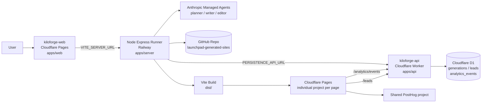
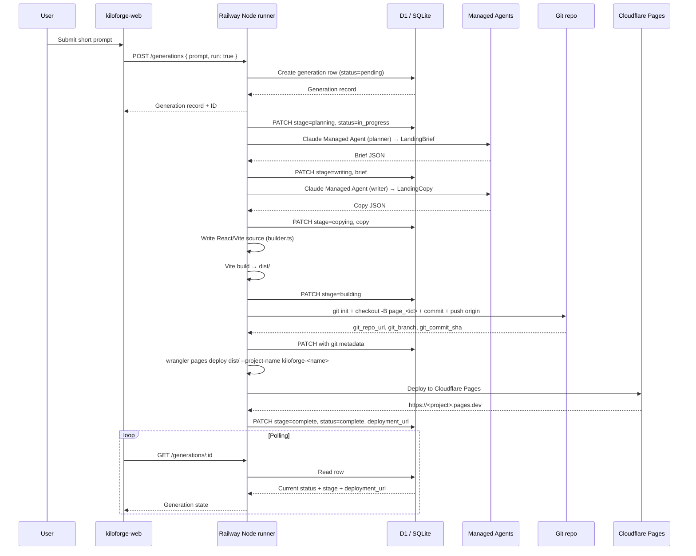
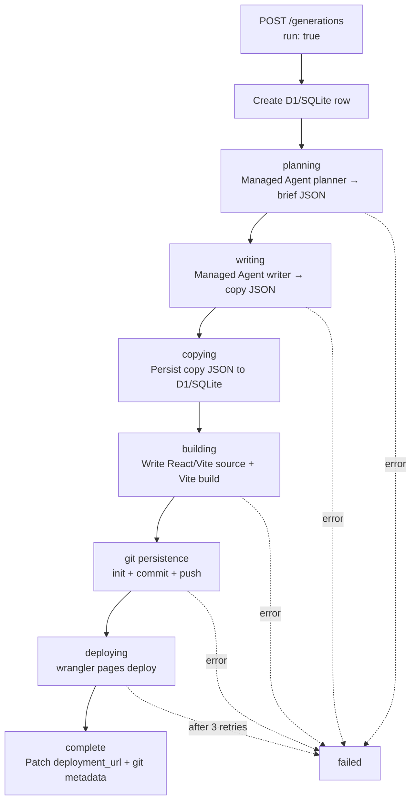
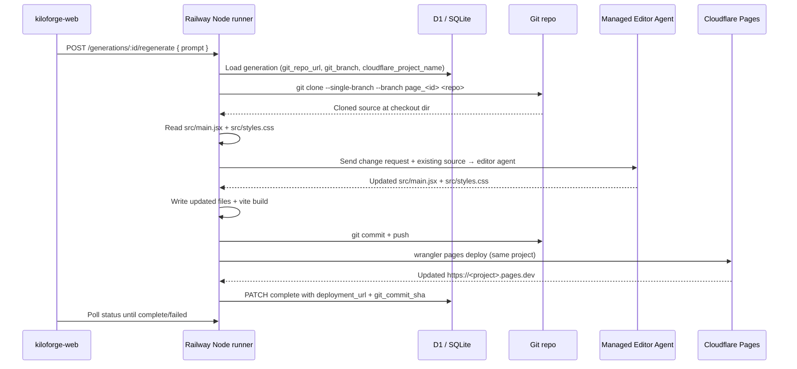

# Kiloforge Architecture

_Last updated: 2026-05-05_

## Goal

Kiloforge takes a short user prompt, generates a React/Vite landing page via Claude Managed Agents, persists the generated source in git, builds with Vite, deploys to Cloudflare Pages, and returns a real `https://<project>.pages.dev` URL. Analytics and lead capture are baked into every generated page.

## System Diagram



## Workspace Layout

```
kiloforge/
├── apps/
│   ├── api/          Cloudflare Worker + D1 (persistence, leads, analytics)
│   ├── server/       Node/Express orchestrator (generation pipeline)
│   └── web/          React/Vite frontend (kiloforge-web on Cloudflare Pages)
├── Dockerfile        Railway Dockerfile
├── railway.json      Railway build/deploy config
├── .env.example      Reference env vars
├── .env.railway      Railway env template
├── ARCHITECTURE.md   This file
├── GOAL.md           Top-level goal
├── PLAN.md           Implementation plan / status
└── pnpm-workspace.yaml
```

## App Responsibilities

### `apps/web` — Kiloforge UI (`kiloforge-web`)

Hosted on **Cloudflare Pages** as `kiloforge-web`.

**Routes:**

| Path | Component | Purpose |
|------|-----------|---------|
| `/` | `MarketingPage` | Marketing/landing site for Kiloforge itself |
| `/new` | `NewPage` | Prompt intake form (`PromptIntake` component) |
| `/g/:id` | `GenerationPage` | Live progress, result display, and workspace editor |
| `/history` | `HistoryPage` | List of past generations |

**Flow per generation:**

1. User submits prompt on `/new`
2. `createGeneration(prompt)` calls `POST <VITE_SERVER_URL>/generations { prompt, run: true }`
3. Navigates to `/g/<id>` which polls `GET /generations/<id>` every 2s (when in_progress) or 8s (idle)
4. Shows `StageProgress` during generation (planning → writing → copying → building → deploying → complete)
5. On complete, shows `ResultDisplay` with the live URL
6. User can open the editor workspace to view/regenerate the page

**Env (set in Cloudflare Pages):**

```env
VITE_SERVER_URL=https://<railway-node-runner-url>
```

The frontend talks to the Railway runner, not the Worker directly.

**UI components:**

- `PromptIntake` — textarea with example prompts
- `StageProgress` — ordered stage list with status indicators
- `ResultDisplay` — live URL display, copy/open buttons, generation metadata
- `WorkspaceShell` — sidebar + canvas layout for the editor workspace
- `SectionSidebar` — section navigation + regenerate controls
- `PreviewCanvas` — iframe preview of the live page
- `HistoryList` — paginated list of past generations

### `apps/server` — Railway Node Runner

The canonical generation and regeneration service. Runs on **Railway** as a Node/Express server.

**Responsibilities:**

- Receive generation requests from `kiloforge-web`
- Create/update generation records (either locally via SQLite or remotely via `PERSISTENCE_API_URL`)
- Call Claude Managed Agents for planning, writing, and editing
- Write generated React/Vite source to disk
- Persist source to the `launchpad-generated-sites` git repo
- Build with Vite
- Deploy `dist/` to Cloudflare Pages via `wrangler pages deploy`
- Patch D1 generation records with `deployment_url`, `cloudflare_project_name`, and git metadata
- Handle regeneration (clone from git, edit via Managed Agent, rebuild, redeploy)

**Architecture:**

- `src/index.ts` — Express app with all routes, CORS, request validation (Zod)
- `src/config.ts` — Env-based config with Zod validation
- `src/db.ts` — SQLite via `better-sqlite3` (WAL mode), auto-migration
- `src/dataApi.ts` — HTTP client for `PERSISTENCE_API_URL` (Worker/D1), used when configured
- `src/landing/types.ts` — Shared types: `LandingBrief`, `LandingCopy`, `BuildResult`, `DeployResult`
- `src/landing/pipeline.ts` — `runGenerationPipeline` / `runRegeneratePipeline` orchestrators
- `src/landing/claudeManaged.ts` — Anthropic Managed Agents client (planner/writer/editor)
- `src/landing/builder.ts` — `buildLandingApp`: writes React/Vite source, runs Vite build
- `src/landing/deployer.ts` — `deployLandingApp`: `wrangler pages deploy` with retries
- `src/landing/gitPersistence.ts` — Git init, commit, push, clone for source persistence
- `src/landing/editor.ts` — `editLandingApp`: sends existing source to Managed Editor agent, rebuilds
- `src/setup.ts` — CLI utility to run DB migrations standalone

**Dual persistence mode:**

When `PERSISTENCE_API_URL` is set, the server proxies all CRUD operations to the Worker/D1 API.
When unset (local development), it uses SQLite directly.

```js
if (dataApi.hasPersistenceApi()) {
  // use HTTP to Worker/D1
} else {
  // use local SQLite
}
```

**Endpoints:**

| Method | Path | Purpose |
|--------|------|---------|
| GET | `/health` | Health check |
| POST | `/generations` | Create generation (optional `run: true` starts pipeline) |
| POST | `/generations/:id/run` | Start/restart pipeline for existing generation |
| POST | `/generations/:id/regenerate` | Regenerate with new prompt (clones git, edits, rebuilds, redeploys) |
| GET | `/generations` | List all generations |
| GET | `/generations/:id` | Get single generation |
| PATCH | `/generations/:id` | Update generation fields (used by pipeline internally) |
| POST | `/leads` | Accept lead submissions (proxied to Worker/D1 if configured) |
| POST | `/analytics/events` | Accept analytics events (proxied to Worker/D1 if configured) |

**Railway env:**

```env
NODE_ENV=production
PORT=3001
APP_URL=https://kiloforge-web.pages.dev
API_URL=https://kiloforge-api.shivom-sharma-eng.workers.dev
PERSISTENCE_API_URL=https://kiloforge-api.shivom-sharma-eng.workers.dev

ANTHROPIC_API_KEY=<secret>
MANAGED_AGENTS_ENVIRONMENT_ID=<secret>
MANAGED_AGENTS_MODEL=claude-sonnet-4-6

CLOUDFLARE_API_TOKEN=<secret>
CLOUDFLARE_ACCOUNT_ID=<secret>
CLOUDFLARE_PAGES_BRANCH=main
DEPLOYMENT_MODE=cloudflare

POSTHOG_KEY=<secret>
POSTHOG_HOST=https://us.i.posthog.com

GENERATED_SITES_DIR=./generated-sites
GENERATED_SITES_GIT_URL=https://github.com/ssh-vom/launchpad-generated-sites.git
GENERATED_SITES_GIT_TOKEN=<secret>
GENERATED_SITES_GIT_USER_NAME=Kiloforge Bot
GENERATED_SITES_GIT_USER_EMAIL=bot@kiloforge.local
```

### `apps/api` — Kiloforge Worker + D1

Cloudflare Worker (`kiloforge-api`) with D1 persistence. Hosted on `workers.dev`.

**Responsibilities:**

- Store generation rows in D1
- Store leads and analytics events in D1
- Accept lead/analytics requests from generated Cloudflare Pages sites
- Provide CORS for `kiloforge-web`, Railway runner, and generated `*.pages.dev` sites
- Serve dynamic `/sites/:pageId` fallback HTML (Worker-side generated pages, fallback only)

**Architecture:**

Single-file `src/index.ts` using **Hono** framework with Zod validation.

- Dynamic page rendering via `renderSite()` — inline HTML/CSS/JS with PostHog analytics + D1 lead capture
- CORS allows configured origins + all `*.pages.dev`
- Worker-side generation uses direct Anthropic Messages API (not Managed Agents; fallback path)
- `runGeneration()` runs in `c.executionCtx.waitUntil()`

**D1 Schema (migrations):**

| Migration | Changes |
|-----------|---------|
| `0001_initial.sql` | Tables: `generations`, `leads`, `analytics_events` |
| `0002_git_metadata.sql` | Adds `project_dir`, `git_repo_url`, `git_branch`, `git_commit_sha` to `generations` |

**Endpoints:**

| Method | Path | Purpose |
|--------|------|---------|
| GET | `/health` | Health check |
| POST | `/generations` | Create generation (optional `run: true` starts Worker-side generation) |
| POST | `/generations/:id/run` | Start Worker-side generation |
| POST | `/generations/:id/regenerate` | Reset and re-run Worker-side generation |
| GET | `/generations` | List generations |
| GET | `/generations/:id` | Get single generation |
| PATCH | `/generations/:id` | Update generation fields (used by Railway runner to patch results) |
| GET | `/sites/:pageId` | Dynamic fallback HTML render (Worker-generated, no Vite build) |
| POST | `/leads` | Accept leads from generated sites |
| POST | `/analytics/events` | Accept analytics events from generated sites |

**Worker env:**

```env
NODE_ENV=production
POSTHOG_HOST=https://us.i.posthog.com
POSTHOG_KEY=<secret>
API_URL=https://kiloforge-api.shivom-sharma-eng.workers.dev
PUBLIC_CORS_ORIGINS=https://kiloforge-web.pages.dev,https://<railway-node-runner-url>
```

## Generation Pipeline

### Initial generation flow



### Pipeline stages



### Regeneration flow



### Claude Managed Agents

The server uses Anthropic's [Managed Agents](https://docs.anthropic.com/en/docs/agents-and-tools/managed-agents) API with three agent roles:

| Agent | System Prompt | Returns |
|-------|--------------|---------|
| **planner** | Expands prompt into a conservative structured brief | `LandingBrief` JSON |
| **writer** | Writes conversion-oriented copy from a brief | `LandingCopy` JSON |
| **editor** | Edits existing React/JSX source code | Updated `main.jsx` + `styles.css` |

All agents are created per-run via `client.beta.agents.create()` with the system prompt, then a session streams text output. The planner and writer return JSON; the editor returns `--- FILE: src/main.jsx ---` delimited file content.

The Worker fallback uses direct Anthropic Messages API (`claudeJson<T>`) — not Managed Agents.

### Git persistence model

Generated source is persisted to a private repo: `github.com/ssh-vom/launchpad-generated-sites`.

- One **branch per generation**: `page_<generated_page_id>`
- Each branch stores source at repo root: `package.json`, `index.html`, `src/main.jsx`, `src/styles.css`, `.gitignore`
- Commit message: `Generate <generated_page_id>` or `Regenerate <generated_page_id>`
- Authentication: HTTPS URL with `x-access-token:<GITHUB_PAT>` embedded in URL

D1/SQLite stores: `git_repo_url`, `git_branch`, `git_commit_sha`.

For regeneration, the branch is cloned fresh, edited by the Managed Editor agent, committed, and pushed.

## Generated Landing Pages

### Source structure

Every generated site is a standard Vite + React project:

```
<project>/
├── package.json    (react, react-dom, posthog-js, vite, @vitejs/plugin-react)
├── index.html      (entry point)
├── src/
│   ├── main.jsx    (React app with analytics + lead form)
│   └── styles.css  (inline styles)
└── dist/           (Vite build output, deployed)
```

### Analytics model

Every generated page sends events to **both** PostHog and the Kiloforge API/D1:

```text
Generated Pages site
  → PostHog capture(event, properties)  (for dashboards/funnels)
  → kiloforge-api /analytics/events     (for internal audit trail)
```

**Standard event properties:**

```text
generation_id
generated_page_id
project_name
cloudflare_project_name
deployment_url / site_url
environment
```

**MVP events:**

| Event | Trigger |
|-------|---------|
| `landing_page_viewed` | Page mount |
| `cta_email_submit_clicked` | Email form submit |
| `email_capture_submitted` | Lead API success |
| `email_capture_failed` | Lead API failure |

### Lead capture

Generated pages submit email captures to `kiloforge-api /leads`. Stored in D1 `leads` table with generation_id, generated_page_id, email, and submission_metadata.

## Cloudflare Worker Fallback Path

The Worker at `/sites/:pageId` can render a dynamically generated page from D1 without a Vite build or Cloudflare Pages deployment. This is a **fallback/preview path only** — the canonical production path goes through the Railway Node runner → Vite build → Cloudflare Pages deploy.

The Worker-generated HTML includes the same inline CSS, PostHog analytics, and lead form as the canonical build output (but rendered server-side rather than as a React app).

## Deployment

### Railway (apps/server)

- **Build**: Dockerfile (multi-stage: pnpm install → build → npm install in runner)
- **Start**: `pnpm --filter server run start`
- **Health**: `GET /health` (configured in railway.json)
- **Restart**: On failure, max 10 retries

### Cloudflare Pages (apps/web)

- **Build**: `pnpm install && pnpm --filter web run build`
- **Env**: `VITE_SERVER_URL` must point at Railway URL

### Cloudflare Worker (apps/api)

- **Deploy**: `pnpm --filter api run deploy` (via wrangler)
- **D1 migrations**: `wrangler d1 migrations apply launchpad-db --remote`

## V2 / Hardening

- Durable queue instead of in-process background jobs
- R2 build logs and artifact snapshots
- Custom domains for generated pages
- Auth and user-owned generations
- Richer templates/components
- Playwright visual QA
- PostHog dashboard links per generated page
- Rollback to previous git commit/deployment
