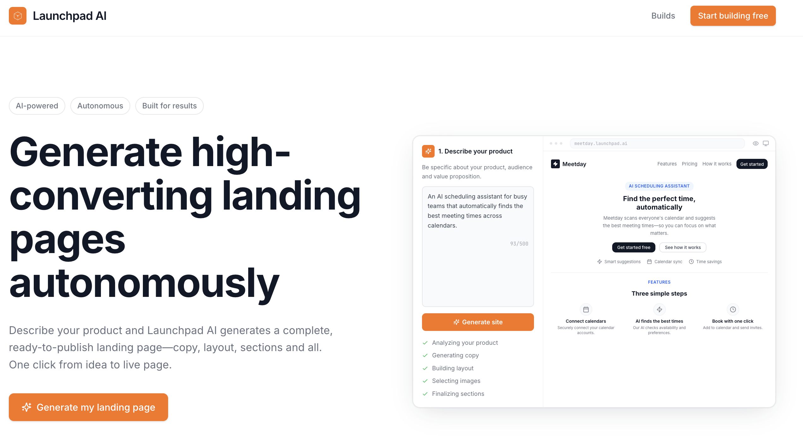
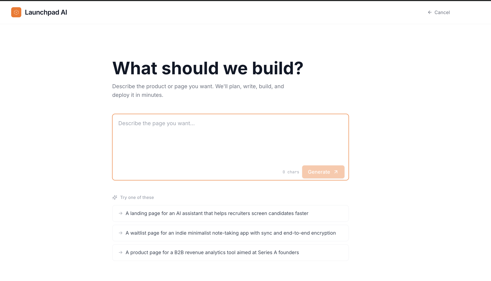
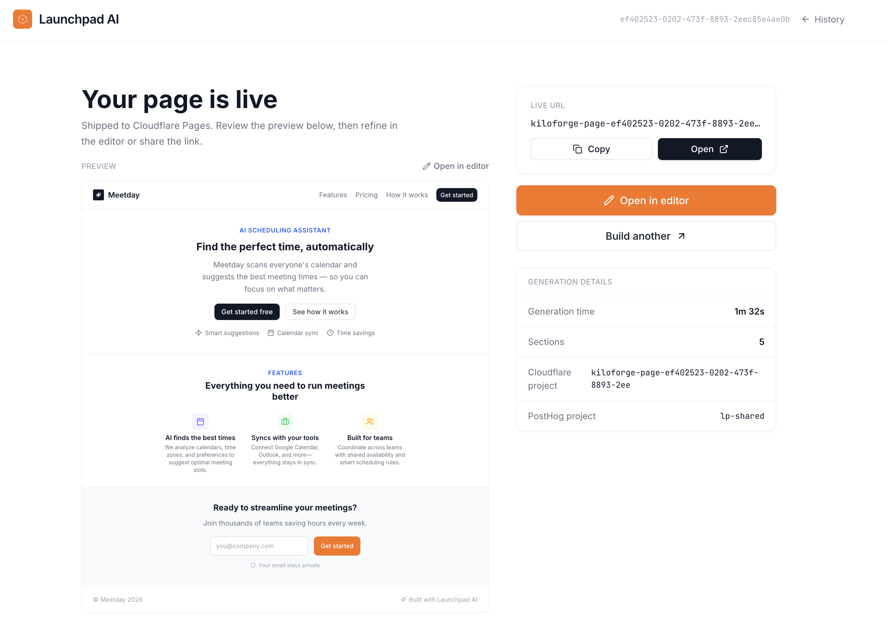
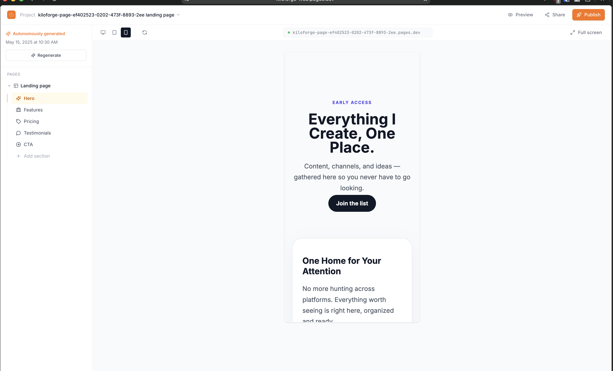
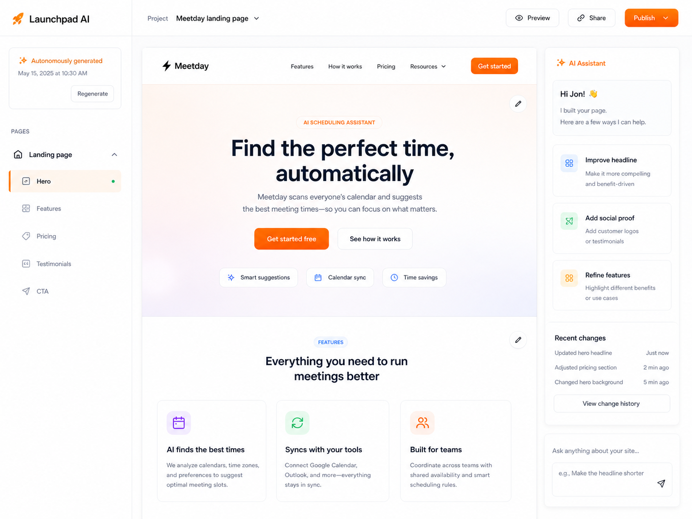

# 🚀 Launchpad AI

> AI-powered landing page generator that takes your product idea and ships a complete, high-converting landing page in under 2 minutes.



## ✨ What is Launchpad AI?

Launchpad AI is an autonomous landing page builder powered by Claude Managed Agents. Simply describe your product, and Launchpad AI plans, writes, builds, and deploys a production-ready landing page — complete with:

- 📝 **Persuasive copy** tailored to your product and audience
- 🎨 **Beautiful layouts** with proven conversion patterns
- 📊 **Built-in analytics** via PostHog integration
- 📧 **Lead capture** forms ready to collect signups
- ⚡ **Instant deployment** to Cloudflare Pages

## 🎯 How It Works

### 1. Describe Your Product



Tell Launchpad AI what you're building. Our AI understands product descriptions, value propositions, and target audiences.

### 2. Watch the Magic Happen

Launchpad AI's Claude Managed Agents work together:
- **Planner** - Structures your page sections and flow
- **Writer** - Crafts compelling headlines, copy, and CTAs
- **Editor** - Assembles everything into clean React components

### 3. Get Your Live Page



Within ~90 seconds, you'll have:
- A live URL at `launchpad-page-*.pages.dev`
- Full source code saved to GitHub
- Ready-to-edit workspace for refinements

### 4. Refine & Customize



Use the built-in editor to:
- Edit text and headlines with AI assistance
- Adjust layouts and sections
- Preview on mobile, tablet, and desktop
- Regenerate specific sections
- Publish updates instantly

## 🏗️ Architecture

Launchpad AI is a monorepo with three main applications:

```
launchpad-ai/
├── apps/
│   ├── api/          Cloudflare Worker + D1 (persistence, leads, analytics)
│   ├── server/       Node/Express orchestrator (generation pipeline)
│   └── web/          React/Vite frontend (launchpad-ai-web)
├── screenshots/      Product screenshots
└── ...
```

### System Flow

```
┌─────────────────────────────────────────────────────────────────┐
│                         User Flow                               │
└─────────────────────────────────────────────────────────────────┘

User ──► launchpad-ai-web (Cloudflare Pages)
              │
              ▼
         Node Express Runner (Railway)
              │
              ├──► Claude Managed Agents (planner/writer/editor)
              ├──► GitHub Repo (source persistence)
              ├──► Vite Build
              └──► Cloudflare Pages (deployed site)
                        │
                        └──► PostHog Analytics
                             Lead Capture ──► D1 Database
```

## 🛠️ Tech Stack

| Layer | Technology |
|-------|------------|
| **Frontend** | React, Vite, TypeScript |
| **AI Engine** | Anthropic Claude (Managed Agents) |
| **Backend** | Node.js, Express |
| **Database** | Cloudflare D1 |
| **Hosting** | Cloudflare Pages, Railway |
| **Analytics** | PostHog |
| **Version Control** | Git/GitHub |

## 🚀 Getting Started

### Prerequisites

- Node.js 18+
- pnpm
- Cloudflare account
- Anthropic API key

### Installation

```bash
# Clone the repository
git clone https://github.com/your-org/launchpad-ai.git
cd launchpad-ai

# Install dependencies
pnpm install

# Copy environment variables
cp .env.example .env

# Start development
pnpm dev
```

### Environment Variables

```env
# Anthropic
ANTHROPIC_API_KEY=your-api-key

# Cloudflare
CLOUDFLARE_ACCOUNT_ID=your-account-id
CLOUDFLARE_API_TOKEN=your-api-token

# GitHub (for source persistence)
GITHUB_TOKEN=your-github-token

# PostHog
POSTHOG_API_KEY=your-posthog-key
```

## 📖 Initial Design

These mockups guided our implementation:

| Landing Page | Editor |
|--------------|--------|
|  |  |

## 📁 Project Structure

```
launchpad-ai/
├── apps/
│   ├── api/                    # Cloudflare Worker API
│   │   ├── src/
│   │   │   ├── index.ts       # Worker entry point
│   │   │   └── routes/        # API routes
│   │   └── wrangler.toml
│   │
│   ├── server/                 # Node.js orchestrator
│   │   ├── src/
│   │   │   ├── index.ts       # Express server
│   │   │   ├── agents/        # Claude agent definitions
│   │   │   ├── pipeline/      # Generation pipeline
│   │   │   └── deploy/        # Deployment handlers
│   │   └── package.json
│   │
│   └── web/                    # React frontend
│       ├── src/
│       │   ├── components/    # UI components
│       │   ├── pages/         # Route pages
│       │   └── hooks/         # Custom hooks
│       └── package.json
│
├── ARCHITECTURE.md             # Detailed architecture docs
├── PLAN.md                     # Implementation roadmap
└── package.json                # Root package.json
```

## 🗺️ Roadmap

- [x] Core generation pipeline
- [x] Cloudflare Pages deployment
- [x] PostHog analytics integration
- [x] Visual page editor
- [ ] Custom domain support
- [ ] Template marketplace
- [ ] Team collaboration
- [ ] A/B testing built-in

## 📄 License

MIT

---

<p align="center">
  Built with ☕ by the Launchpad AI team
</p>
